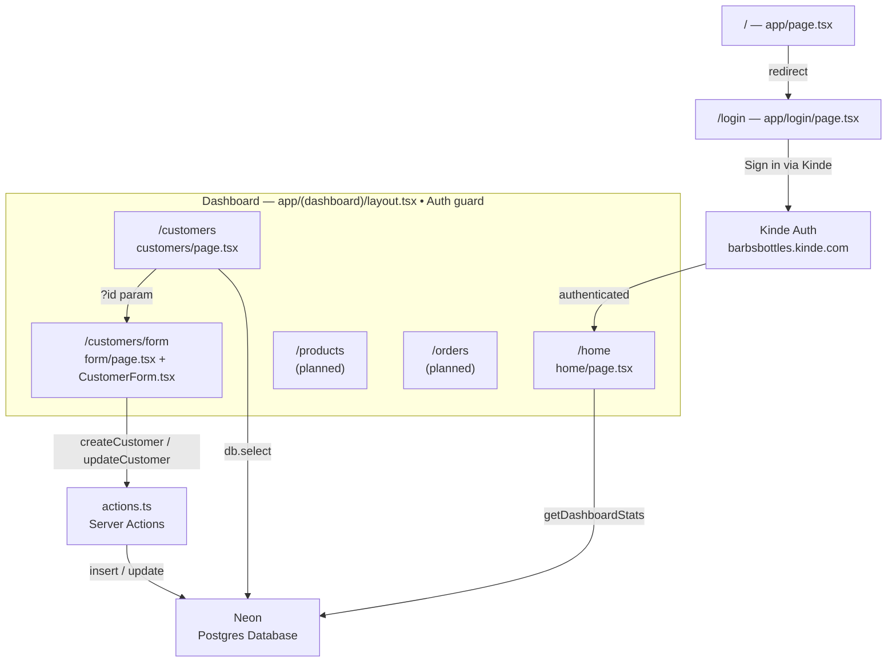

# Barb's Bottles — Project Notes

A central index for all project documentation. Click any link to open the note directly in Obsidian.

---

## TODO

### In Progress
- [ ] Fix nav text/icons black in dark mode → `components/NavButton.tsx`, `ModeToggle.tsx`, `Header.tsx` — see [[Customer_Pages_Coding_Guide]]
- [ ] Fix Edit button dark mode + add blue outline → `app/(dashboard)/customers/page.tsx` lines 144 & 176 — see [[Customer_Pages_Coding_Guide]]
- [ ] Fix Quick Action buttons black instead of blue → `app/(dashboard)/home/page.tsx` lines 85, 88, 91 — see [[Customer_Pages_Coding_Guide]]
- [ ] Add `app/(dashboard)/error.tsx` Sentry error boundary — see [[Sentry_Setup]]

### Before Production
- [ ] Lower `tracesSampleRate` from `1` to `0.1` in all three Sentry config files — see [[Sentry_Setup]]
- [ ] Review `sendDefaultPii: true` for GDPR compliance — see [[Sentry_Setup]]
- [ ] Move Sentry DSN to `NEXT_PUBLIC_SENTRY_DSN` environment variable — see [[Sentry_Setup]]
- [ ] Look into dotenvx precommit to prevent committing `.env` files — see [[DataBase_Debug]]

### Obsidian Setup
- [ ] Install Dataview plugin — auto-generate live TODO lists from all notes
- [ ] Install Templater plugin — consistent structure for new notes
- [ ] Install Tasks plugin — enhanced checkbox management
- [ ] Install Git plugin — commit notes alongside code from inside Obsidian

---

## App Layout

---

## Services

| Service | Purpose | Dashboard |
|---------|---------|-----------|
| [Kinde](https://app.kinde.com) | Authentication & user management | app.kinde.com |
| [Neon](https://console.neon.tech) | Postgres database | console.neon.tech |
| [Sentry](https://axis-marketing.sentry.io/projects/barbs-bottles/) | Error tracking & performance monitoring | sentry.io → axis-marketing → barbs-bottles |
| [Vercel](https://vercel.com/dashboard) | Hosting & deployment | vercel.com/dashboard |
| GitNexus | Code intelligence & impact analysis | `npx gitnexus serve` (local) |
| Drizzle | ORM & schema management | `npx drizzle-kit studio` (local) |

---

## Guides
Step-by-step coding guides for building features.

- [[Customer_Pages_Coding_Guide]] — Server actions, form, and customer list pages with all review fixes applied
- [[Product_Pages_Coding_Guide]] — Server actions, form, and product list pages with product-specific field handling (JSON colors, enums, decimal price)
- [[Product_Image_Upload_Guide]] — Add UploadThing image uploads to products after orders are built *(do this last)*

---

## Debugging
Logs of bugs encountered, their root cause, and how they were resolved.

- [[Bug_Fixes]] — App-level bugs (login redirect, root page, post-login URL)
- [[DataBase_Debug]] — Neon database connection and migration failures
- [[Seed_Debug]] — Seed script schema mismatches

---

## Setup & Configuration
Reference docs for tools and services wired into the project.

- [[Sentry_Setup]] — What is configured, what is missing, and pre-production checklist
- [[GitNexus_Integration]] — GitNexus workflow: when to run analyze, how to use with AI tools

---

## Reviews
PR and code reviews.

- [[PR1_Customer_Pages_Review]] — Review of Copilot PR #1 (customers list and form pages)

---

## Archive
Notes from other AI tools kept for comparison. Useful for seeing how different models approached the same problem.

### Gemini
- [[GEM_Dashboard_Best_Practices]] — DAL pattern, best practices, and applied fixes for dashboard page
- [[Gem_Dashboard_Fixes]] — Dashboard page error corrections
- [[Gem_Sentry]] — Sentry integration guide for dashboard page

### Copilot
- [[Cop_Dashboard_fixes]] — Dashboard page error corrections
- [[Cop_Sentry_Notes]] — Sentry implementation notes for dashboard page
