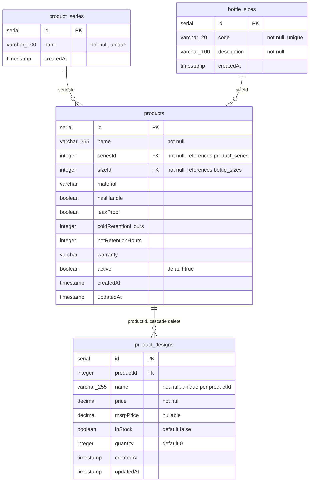

# Products Data Model & Page Flows

Reference notes on how `products` / `product_designs` are shaped in the database, and how the products list, add-product, and edit-product pages read and write them. Written while researching UI changes to `ProductForm.tsx` on `products-inventory-update`.

Claude Code Diagram:
https://claude.ai/code/artifact/781d0c72-b59a-4610-be02-f246fd31c803?via=auto_preview

> **Update (2026-07-29):** `products.series`/`products.size` (shown as plain `varchar`/`enum` below) have been replaced by `seriesId`/`sizeId` FKs into new `product_series`/`bottle_sizes` lookup tables, and the products page/edit flows described below have been substantially restructured. See "Update: design-first catalog restructure" at the end of this doc for the current shape — the sections below are left as the original research notes.

## Schema

### `products` — one row per size/SKU

| Column | Type | Notes |
|---|---|---|
| `id` | serial | PK |
| `name` | varchar(255) | not null |
| `seriesId` | integer | FK → `product_series.id`, not null |
| `sizeId` | integer | FK → `bottle_sizes.id`, not null |
| `material`, `hasHandle`, `leakProof`, `coldRetentionHours`, `hotRetentionHours`, `warranty` | mixed | bottle spec fields — shared across every design on this product row |
| `description`, `features`, `rating`, `reviewCount`, `designTemplate`, `designPreview`, `designVariations` | mixed | descriptive/display fields |
| `active` | boolean | default `true` |
| `createdAt` / `updatedAt` | timestamp | |

`product_series` (`id`, `name` unique) and `bottle_sizes` (`id`, `code` unique, `description`) are small lookup tables — new series/sizes can be added from the Add Product page (or the single-variant editor) via an inline "Add" action, no migration required.

Also referenced by `order_items.product_id` (out of scope here).

### `product_designs` — one row per named design

| Column | Type | Notes |
|---|---|---|
| `id` | serial | PK |
| `productId` | integer | FK → `products.id`, cascade delete |
| `name` | varchar(255) | not null, **`unique(productId, name)`** — a design name can't repeat within one product |
| `price` | decimal(10,2) | not null |
| `msrpPrice` | decimal(10,2) | nullable |
| `inStock` | boolean | default `false` |
| `quantity` | integer | default `0` |
| `createdAt` / `updatedAt` | timestamp | |

Every existing product currently has multiple designs — anywhere from **4 to 79** per product, confirmed by querying the live data (10 products, all multi-design).

## Page & data flow

```mermaid
flowchart TD
    subgraph List["Products list — /products"]
        L1["Query: products ⋈ product_designs (inner join)"] --> L2["Group in memory by series :: design.name → DesignGroup[]"]
        L2 --> L3["Render ProductDesignRow (expandable)"]
        L3 --> L4["Link → /products/form?id={productId} per variant"]
    end

    subgraph Add["Add product — /products/form"]
        A1["No ?id → product = null"] --> A2["ProductForm (isEditing = false), one blank design row"]
        A2 --> A3["createProduct(formData)"]
        A3 --> A4["validate: insertProductSchema + per-row insertProductDesignSchema"]
        A4 --> A5["INSERT products (1) → INSERT product_designs (N)"]
        A5 --> A6["revalidatePath + redirect → /products"]
    end

    subgraph Edit["Edit product — /products/form?id={id}"]
        E1["Fetch product by id + its designs (notFound() if missing)"] --> E2["ProductForm (isEditing = true), pre-filled rows (4-79)"]
        E2 --> E3["updateProduct(id, formData)"]
        E3 --> E4["validate: same schemas as create"]
        E4 --> E5["UPDATE products → DELETE product_designs → INSERT product_designs"]
        E5 --> E6["revalidatePath + redirect → /products"]
    end
```

### Products list — `/products` (`page.tsx`)

1. **Query**: `products ⋈ product_designs`, inner join, ordered by `product.createdAt desc`.
2. **Reshape in memory**: group rows by `series :: design.name` into `DesignGroup[]`, each holding a `variants[]` array (the product/size rows sharing that design name).
3. **Render**: `ProductDesignRow` — one expandable row per design; expanding shows the size variants.
4. **Link**: each variant's Edit button points to `/products/form?id={productId}`.

> One row on this page is a **design** spanning sizes, not a single product row — the grouping is computed on every page load, not stored.

### Add product — `/products/form`

1. No `?id` → `product = null`.
2. `ProductForm` renders with `isEditing = false`, starting with one blank design row (`+ Add Design` appends more).
3. Submit calls server action `createProduct(formData)`.
4. Validates via `insertProductSchema` (product) plus per-row `insertProductDesignSchema` (designs), including a duplicate-name check across rows.
5. Writes: `INSERT products` (1 row), then `INSERT product_designs` (N rows, `productId` = new product's id).
6. `revalidatePath("/products")` then redirect to `/products`.

> One submit creates exactly **one product row (= one size)** plus all of its named designs together.

### Edit product — `/products/form?id={id}`

1. Fetches the `product` row by id and all of its `product_designs` rows; `notFound()` if the id is missing or non-numeric.
2. Same `ProductForm` component, `isEditing = true`, pre-filled with existing designs (could be 4–79 rows).
3. Submit calls server action `updateProduct(id, formData)` (`id` bound via `.bind`).
4. Same validation as create.
5. Writes: `UPDATE products SET ... WHERE id`, then `DELETE product_designs WHERE productId = id`, then `INSERT product_designs` with whatever the form submitted.
6. `revalidatePath("/products")` then redirect to `/products`.

> Edit targets a **single product/size row**. Its whole design list is deleted and reinserted from what the form submits — nothing is diffed.

## Worth knowing

1. **Add and Edit are one component and one code path.** Both routes render `ProductForm.tsx` and share the same field-parsing/validation logic in `actions.ts` — a layout or field change made for one applies to both automatically.
2. **Editing replaces, not patches, the design list.** Every save deletes all existing `product_designs` rows for that product and reinserts whatever the form currently holds. For a product with 79 designs, that's 79 rows round-tripped through the browser on every edit.
3. **All 10 current products already have multiple designs** (4–79 each), so any form change that assumes "one design per product" would conflict with real, existing data.

## Update: design-first catalog restructure (2026-07-29)

Implemented as `openspec/changes/product-design-catalog-restructure`. The page flows above describe the original series-grouped model; this section covers what replaced it.

**Products list (`/products`)** now groups by **design name alone**, not `series :: design.name` — one row per design, spanning every series it appears in. Columns: `Design | Series Avail | In Stock | Action`. Expanding a row lists every series/size variant (previously just size, since series was fixed per group).

**Three edit surfaces now exist**, each with a narrower job than the old single `/products/form?id=` link:

| Surface | Route | Scope |
|---|---|---|
| Bulk design editor | `/products/design/[name]` | Price/MSRP/Quantity/Active for every series/size variant of **one design**, saved together via `db.batch()` (the project's `neon-http` Drizzle driver has no `db.transaction()` support — confirmed in `node_modules/drizzle-orm/neon-http/session.js`, which throws `"No transactions support in neon-http driver"`). No add/remove-variant controls. |
| Single-variant editor | `/products/design-variant/[id]` | One `product_designs` row: Product Name (dropdown + add), Design Name (dropdown, no free-text rename), the shared `products`-level fields (retention/warranty/handle/leak-proof — **editing these here silently applies to every sibling design on that product row**, since they're stored once per product), Price/MSRP/Quantity, Active. Series/Size shown read-only as page context. Has Update/Cancel/Remove (Remove also deletes the parent `products` row if it was the last design on it). |
| `ProductForm` edit (`/products/form?id=`) | unchanged route | Kept specifically for adding a brand-new design/colorway to an existing product row, or editing shared fields with every sibling design visible at once — neither new page covers either case. Reachable via a "Manage Designs" link next to each variant. |

**Add Product page (`/products/form`, no `id`)**: Product Name changed from free text to a dropdown of existing names + inline "Add Product Name"; Series and Size changed from the hardcoded `ProductConstants` arrays to dropdowns backed by the `product_series`/`bottle_sizes` lookup tables, each with an inline "Add" action (calls `createProductSeries`/`createBottleSize` in `actions.ts`, case-insensitive duplicate rejection). Design rows no longer pre-populate one blank row — they start empty until "Add Design" is clicked (edit flow is unaffected, still pre-fills from existing designs).

A design whose variants are all set inactive stays listed (marked "Inactive", same `anyActive` logic as before) — it only disappears from the products page once its variants are actually deleted via the single-variant editor's Remove action, not just deactivated.
